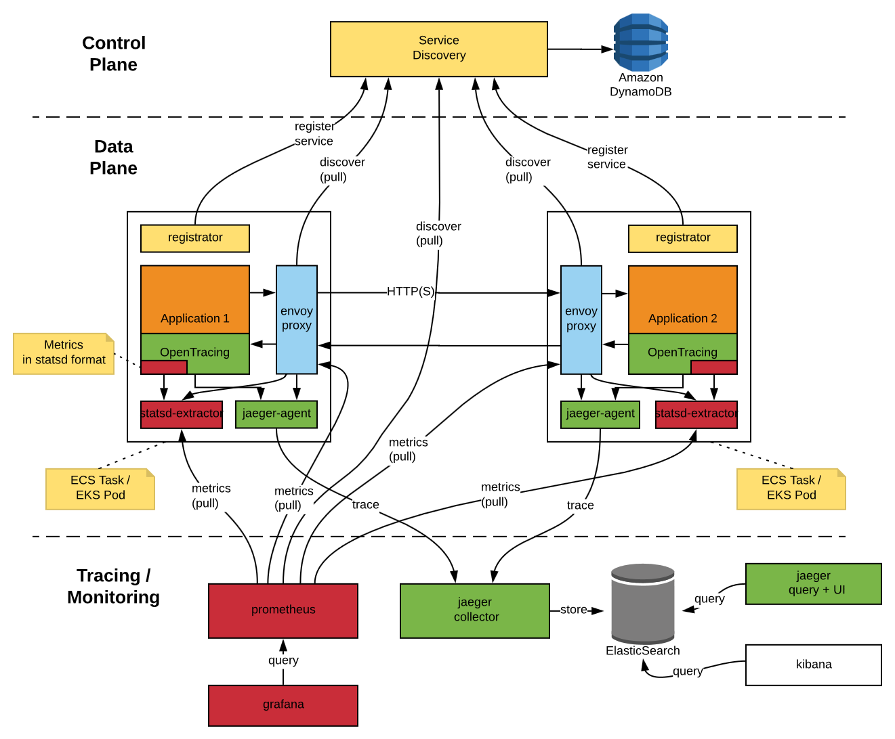
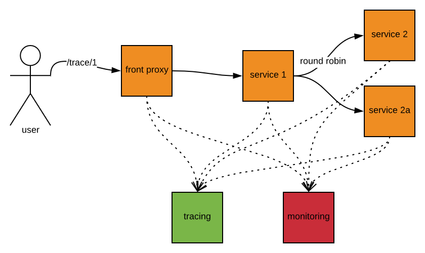

This example is based on the original [example from Envoy's creators](https://github.com/envoyproxy/envoy/tree/master/examples/jaeger-tracing).

# Demo
I've added new features in the example:
- every Envoy and service is running in a separate container. I think this is one of the crucial points in ServiceMesh approach.
- Service Discovery is running (I've only dockerized [Lyft discovery](https://github.com/lyft/discovery) service)
- every Envoy has its own simple [registrator](https://github.com/javajefe/lyft-discovery-registrator) which registers envoy in the Service Discovery
- ElasticSearch is used as a storage backend for Jaeger
- Kibana is also running to look inside the ElasticSearch
- Jaeger is deployed as a set of components, not all-in-one
- all Envoy configurations are using templating to be able to configure Envoys with environment variables
- many Envoy capabilities are demonstrated (health checks, rewrites, retries, outliers, firewall, tls, etc.), see branches for more
- some small improvements for Python "services" (for example, shutdown API)
- all Envoys are monitored with help of Prometheus and Grafana. Because currently Envoy has some issues exporting histogram, I've added statsd-exporter for every Envoy
- Grafana dashboards added

### HLV


# How to build and run
> To enable ElasticSearch in Docker run 
> ```sudo sysctl -w vm.max_map_count=262144```
> on the host OS. See https://github.com/spujadas/elk-docker/issues/92 for details.

Use
```sudo docker-compose up -d --build```
to build and run everything. ElasticSearch is the slowest part of the deployment so be patient :-).
When you check the status of all containers,  don't be surprised by not running `jaeger-dependencies` container - actually it is a job wrapped in a container, so this is its normal behaviour. You may run it later when you make several HTTP calls and get few traces in Jaeger. Use 
```sudo docker-compose up -d jaeger-dependencies```

# How to use it
Open in your browser any of these links:
- http://localhost:8000/service/1 - executes a call to service1
- http://localhost:8000/service/2 - executes a call to service2 and service2a with round robin
- http://localhost:8000/trace/1 - executes a chain of calls: service1 -> service2 (or 2a with round robin)
- http://localhost:8000/trace/2 - executes a call service2/2a

- Then open http://localhost:16686 in a separate tab - it is Jaeger UI, there you can look at traces of calls you've executed.
- Kibana can be found at http://localhost:5601 , go to the "Management" menu and define `jaeger-span-*` as a default index pattern.
- Envoy front proxy admin page is at http://localhost:8001 .
- Prometheus is at http://localhost:9090 .
- Grafana is at http://localhost:3000 (use `admin` / `admin` to login).
- Service Discovery current state is at http://localhost:8080/v1/registration/repo/SRN .

### Prometheus queries examples
```
histogram_quantile(0.90, sum(rate(envoy_cluster_upstream_rq_time_bucket{cluster_name != "xds_cluster", cluster_name != "statsd_in", cluster_name != "local_service", cluster_name != "jaeger"}[1m])) by (le,cluster_name))
```

```
sum(envoy_cluster_membership_healthy) by (cluster_name)
```

### Tweaking
- Grafana dashboards are in `./grafana/dashboards` directory
- Prometheus configuration is in `./prometheus` directory
- statsd-exporter configuration is in `./statsd` directory

##### API call concept
When you execute http://localhost:8000/trace/1 it goes like this:


# How to clean it
Local docker volumes are used to keep the data between deployment. So if you want to clean up your data, use
```
docker volume rm envoy-s2s-example_esdata envoy-s2s-example_grafana_data envoy-s2s-example_prometheus_data envoy-s2s-example_prometheus_filesd
```

# References
- [original example](https://github.com/envoyproxy/envoy/tree/master/examples/jaeger-tracing) from Envoy team
- [jwilder/dockerize](https://github.com/jwilder/dockerize) to implement templating for Envoy's configuration files
- [Lyft/discovery](https://github.com/lyft/discovery) - Service Discovery from Lyft. It uses old protocol (v1), but it was a simplest way to start. I've just [dockerized](https://hub.docker.com/r/javajefe/lyft-discovery/) it without any changes
- [transferwise/prometheus-envoy-dashboards](https://github.com/transferwise/prometheus-envoy-dashboards) - I got Grafana dashboards and Prometheus here, but updated them for the latest Envoy version
- [bakins/kubernetes-envoy-example](https://github.com/bakins/kubernetes-envoy-example) - some ideas about Prometheus were gotten from here
- [simple services registrator](https://github.com/javajefe/lyft-discovery-registrator) written by me to connect with Lyft/discovery Service Discovery. You can use [docker image](https://hub.docker.com/r/javajefe/lyft-discovery-registrator/) also
- [simple Prometheus file_sd discovery enables](https://github.com/javajefe/lyft-discovery-prometheus-file-sd) written by me to connect Prometheus with Lyft/discovery Service Discovery. You can use [docker image](https://hub.docker.com/r/javajefe/lyft-discovery-prometheus-file-sd/) also
