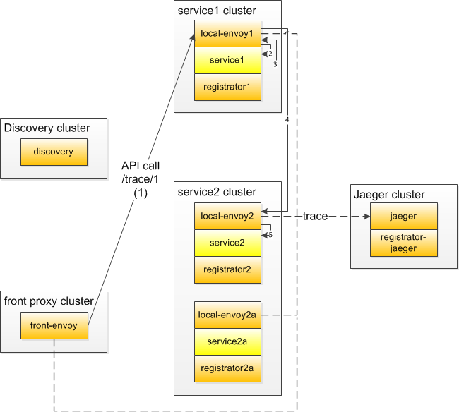
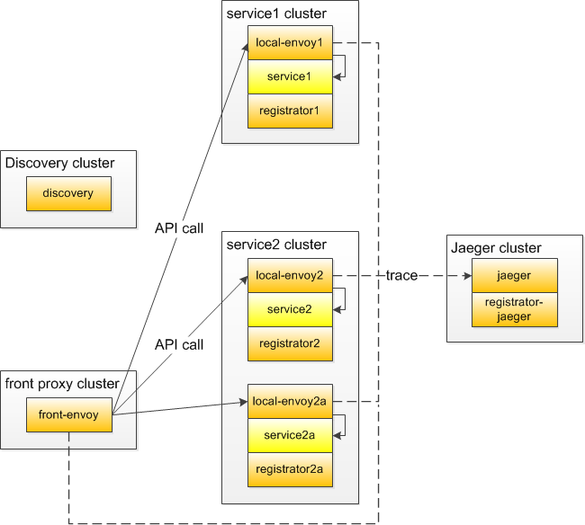

This example is based on the original [envoy docs](https://www.envoyproxy.io/docs/envoy/latest/start/sandboxes/).

# Demo
I've added following useful things in the example:
- every Envoy and service is running in a separate container. I think this is one of the crucial points in ServiceMesh approach.
- Service Discovery is running (it is a Lyft discovery service)
- every Envoy has its own simple registrator which registers envoy in the Service Discovery
- ElasticSearch is used as a storage backend for Jaeger
- Kibana is also running to look inside the ElasticSearch
- Jaeger is deployed as it should be deployed in production, not all-in-one
- all Envoy configurations are using templating to configure Envoys with environment variables
- many Envoy capabilities are demonstrated (health checks, rewrites, retries, outliers, firewall, tls, etc.), see branches for more
- some small improvements for Python "services"

### Discovery phase


### API call phase


# How to build and run
To enable ElasticSearch in Docker run 
```sudo sysctl -w vm.max_map_count=262144```
on the host OS. See https://github.com/spujadas/elk-docker/issues/92 for details.

Use
```sudo docker-compose up -d --build```
to build and run everything. ElasticSearch is the slowest part of the deployment so be patient :-).
When you check the status of all containers,  don't be surprised by not running `jaeger-dependencies` container - actually it is a job in a container, so this is its normal behaviour. You may run it later when you make several HTTP calls and get few traces in Jaeger. Use 
```sudo docker-compose up -d jaeger-dependencies```

# How to use it
Open in your browser any of the links:
- http://localhost:8000/service/1 - calls service1
- http://localhost:8000/service/2 - calls service2 and service2a with round robin
- http://localhost:8000/trace/1 - makes the chain of calls: service1 -> service2/2a
- http://localhost:8000/trace/2 - calls service2/2a

Then open in a separate tab http://localhost:16686 - this is Jaeger UI, there you can look at traces you've made.
Kibana can be found at http://localhost:5601
Envoy front proxy admin page is at http://localhost:8001 